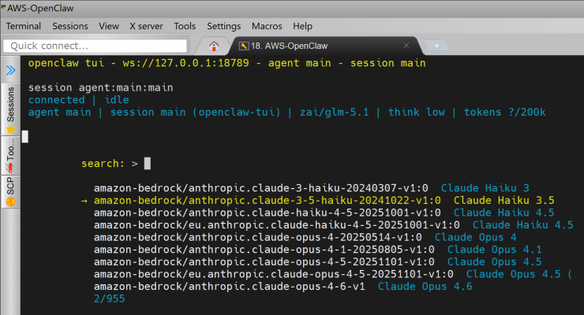
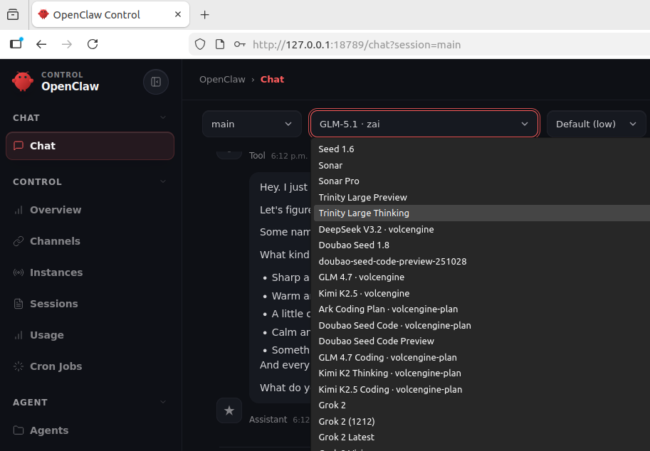

# OpenClaw on AWS EC2 with Amazon Bedrock

Terraform configuration that provisions an Amazon Linux 2023 EC2 instance, installs [OpenClaw](https://openclaw.ai) via the official installer, and configures it to use **Amazon Bedrock** as the default model provider. The instance role grants API access so OpenClaw can call Bedrock without long-lived keys in application config.

Tested with `OpenClaw 2026.4.20 (115f05d)`

## What this Terraform Provison

| Resource | Purpose |
|----------|---------|
| **EC2 instance** | Runs OpenClaw; latest AL2023 x86_64 AMI, encrypted gp3 root volume |
| **Security group** | Egress allowed; **ingress only SSH (22)** from the **public IP detected at apply time** (`checkip.amazonaws.com`) |
| **IAM instance profile** | Either `AmazonBedrockFullAccess` or `PowerUserAccess` (see variables) |
| **Random token** | Gateway auth token, passed into `user_data` and exposed as a Terraform output |

On first boot, `user_data.sh` installs OpenClaw, writes `/root/.openclaw/.env` and `openclaw.json` (gateway mode, Bedrock plugin, default model), then starts the OpenClaw gateway as a user service for `root`.

## Quick start

1. Edit `terraform.tfvars` with your `aws_region`, `instance_type`, `ssh_key_name`, and `openclaw_model` or leave default.

2. Initialize and apply:

   ```bash
   terraform init
   terraform plan
   terraform apply
   ```

3. After apply, note the outputs:

   - `openclaw_public_ip` — instance public IPv4  
   - `ssh_allowed_from_ip` — the IP Terraform used for the SSH rule (your IP at apply time)  
   - `token` — gateway token  
   - `zenjoy` — example `openclaw tui` command including the token  

4. SSH to the instance (replace key path and user as needed; AL2023 default user is `ec2-user`):

   ```bash
   ssh -i your-key.pem ec2-user@<openclaw_public_ip>
   ```

5. **Port forward** to use the gateway UI bound on the instance loopback (adjust local port if you like):

   ```bash
   ssh -i your-key.pem -L 18789:127.0.0.1:18789 ec2-user@<openclaw_public_ip>
   ```

   Then open `http://127.0.0.1:18789` in your browser on your laptop.

## Variables

| Name | Description | Default |
|------|-------------|---------|
| `aws_region` | AWS region for all resources | `us-west-2` |
| `instance_type` | EC2 instance type | `t3.xlarge` |
| `instance_volume_size` | Root gp3 volume size (GiB) | `20` |
| `ssh_key_name` | EC2 key pair name in that region; `null` if using other access methods | `null` |
| `openclaw_port` | Gateway port in `openclaw.json` | `18789` |
| `openclaw_model` | Default Bedrock model string for agents | `amazon-bedrock/zai.glm-5` |
| `enable_poweruser` | If `true`, attach `PowerUserAccess`; if `false`, attach only `AmazonBedrockFullAccess` | `true` |


## Cleanup

```bash
terraform destroy
```
## AWS Bedrock Model Selection in TUI:<br>


## AWS Bedrock Model Selection in GUI:<br>


---
Don't forget to click on 🌟 !!!<br>
**Subscribe to my YouTube Channel**: [ADV-IT - @adv-it](https://www.youtube.com/@adv-it) <br>
Copyleft © Denis Astahov - 2026.
